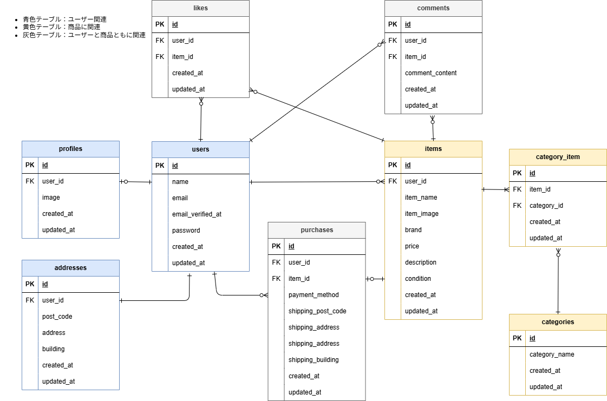

# 模擬案件_フリマ：flea-market-app
<!-- 7/30書けるところまで明記、最終提出前に必ずチェックすること -->

## 前提条件
- Gitがインストールされている
- GitHubが使用できる状態
    - SSH接続が設定済みであること
- Docker & Docker Composeを使用できる状態


## 環境構築

**Dockerビルド**
1. git clone git@github.com:ai2525desu/flea-market-app.git
2. Docker Desktopを立ち上げる
3. docker compose up -d --build

**Laravel環境構築**
1. docker compose exec php bash
2. composer install
3. 「.env example」ファイルを「.env」ファイルに命名変更。または、新しく「.env」ファイルを作成する。
4. 「.env」ファイルの該当箇所に下記の環境変数を追加
    * DBに関する記述
    ```
    DB_CONNECTION=mysql
    DB_HOST=mysql
    DB_PORT=3306
    DB_DATABASE=laravel_db
    DB_USERNAME=laravel_user
    DB_PASSWORD=laravel_pass
    ```
    * テスト用メール送信設定(Mailhog)に関する記述
    ```
    MAIL_MAILER=smtp
    MAIL_HOST=mailhog
    MAIL_PORT=1025
    MAIL_USERNAME=null
    MAIL_PASSWORD=null
    MAIL_ENCRYPTION=null
    MAIL_FROM_ADDRESS=mailhog-test@example.com
    MAIL_FROM_NAME="${APP_NAME}"
    ```
    * Stripeに関する記述
     - 各キーはStripe(https://stripe.com/jp)のダッシュボードより取得したキーをコピー＆ペーストし、記述する
    ```
    STRIPE_KEY=pk_test_****
    STRIPE_SECRET=sk_test_****
    STRIPE_WEBHOOK_SECRET=whsec_*******
    ```
5. アプリケーションキーの作成<br>
    ``` php artisan key:generate ```
6. src/storage/app/publicのディレクトリ下に保存してある画像を使用するために、シンボリックリンク作成<br>
    ``` php artisan storage:link ```
7. テーブルデータ反映のためにマイグレーションの実行<br>
    ``` php artisan migrate ```
8. ダミーデータ反映のためにシーディング実行<br>
    ``` php artisan db:seed ```

**使用するマイグレーションファイル一覧**
* 2014_10_12_000000_create_users_table.php
* 2025_07_30_001936_create_profiles_table.php
* 2025_07_30_002026_create_addresses_table.php
* 2025_07_30_002051_create_items_table.php
* 2025_07_30_002114_create_categories_table.php
* 2025_07_30_002137_create_category_item_table.php
* 2025_07_30_002157_create_purchases_table.php
* 2025_07_30_002213_create_comments_table.php
* 2025_07_30_002225_create_likes_table.php

**シーダーファイル**
* CategoriesTableSeeder.php
* ItemsTableSeeder.php

## 使用環境（実行環境）
- Windows 11 Home
- Ubuntu 24.04.1 LTS
- VSCode 1.101.2
- Docker version 28.3.2
- Laravel Framework 8.83.29
- PHP 8.1
- nginx:1.21.1
- mysql:8.0.26
- Mailhog

## Mailhogを使用したメール送信テストの手順
1. ユーザーの会員登録を行う
2. メール認証画面(/email/verify)より、「認証はこちら」を選択して認証メールを送信
    - 再送の場合は「認証メールを再送する」を選択
3. Mailhog Web UIで届いた認証メールを確認
    - URL:http://localhost:8025/
4. メール内の認証リンクをブラウザで開く
5. 認証完了後、自動的にプロフィール設定画面に遷移

## Stripeを使用した決済テストの手順(ローカルサーバーの場合)
<!-- StripeCLIを使用したWebhookの秘密鍵の取得等についてコーチに確認中 -->
1. Stripe CLIによってWebhookと接続状態にする
    - **コンテナの再起動時やLaravelサーバーの再起動時には毎回この手順が必要**
    - Stripeにログイン<br>
        ``` stripe login ```
    - Webhookに接続<br>
        ``` stripe listen --forward-to http://localhost/stripe/webhook ```
2. 商品購入画面より、購入するをクリック
    - Stripe決済画面に遷移する
3. 決済画面でテストカード番号を入力
    - テストカード番号例: 4242 4242 4242 4242 / 期限任意 / CVC任意
4. Webhook で決済を受信し、Laravel 側で購入ステータスが更新されたことを確認して決済完了


## 権限エラー対策（Windows）
* ホストとコンテナ間のファイル権限不一致によるエラーを防ぐため、docker/php/Dockerfileにて独自ユーザー('ai2525desu')を作成し、root権限以外でLaravelを実行している
    - Dockerfile一部抜粋<br>
    ```RUN useradd -m ai2525desu```
* docker-compose.ymlにてphpの箇所に下記記載を付け加えることでユーザーIDを指定している
    - 一部抜粋
        ```
        php:
            build: ./docker/php
            user: "1000:1000"
            volumes:
            - ./src:/var/www/
        ```

## ER図


## URL
* 商品一覧ページ(TOPページ):http://localhost/
* phpmyadmin:http://localhost:8080
* Mailhog Web UI:http://localhost:8025/
* Stripe:https://stripe.com/jp
